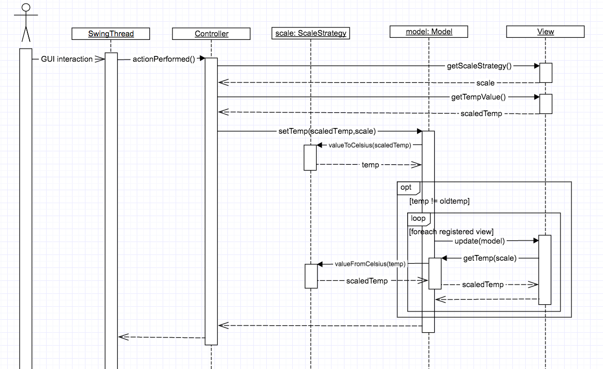

# Corso di Ingegneria del Software a.a. 2018/19

## Laboratorio 10

Questo laboratorio si svolge in gruppi di **quattro studenti** (suddivisi in due coppie da due studenti ciascuna).

Ogni **gruppo** di studenti procede ad effettuare il **fork** di questo repository.
Inoltre, concede i permessi di scrittura al propri compagni di team e i **permessi di lettura** a **entrambi** i docenti (`carlobellettini`, `mmonga`).

TEAMMATE 1: Lombarda Alessia 908879 alessia_lombarda
TEAMMATE 2: Politano Andrea 909153 andrea_politano
TEAMMATE 3: Valota Andrea 908884 Andrea_Valota
TEAMMATE 4: Notarangelo Elisa 920295 elinot15

## Processo

Una volta effettuato il **clone** del repository, il gruppo esegue il comando `git flow init` all'interno della directory clonata.
Dopodiché, il gruppo implementa secondo la *metodologia TDD*
le specifiche riportate di seguito; in maggior dettaglio, ripete i passi seguenti fino ad aver implementato tutte le funzionalità richieste:

* crea un nuovo *branch* per la funzionalità corrente attraverso l'esecuzione del comando `git flow feature start <nome feature>`,
* implementa un test per le funzionalità richieste **procedendo nell'ordine** in cui sono specificate,
* verifica che **il codice compili correttamente**, ma l'**esecuzione del test fallisca**; solo a questo punto effettua un *commit* (usando `git add` e `git commit`) iniziando il messaggio di commit con la stringa `ROSSO:`,
* aggiunge la minima implementazione necessaria a realizzare la funzionalità, in modo che **il test esegua con successo**; solo a questo punto
  effettua un *commit* (usando `git add` e `git commit`) iniziando il messaggio di commit con la stringa `VERDE:`,
* procede, se necessario, al **refactoring** del codice, accertandosi che le modifiche non comportino il fallimento di alcun test; solo in questo caso fa seguire ad ogni
  passo un *commit* (usando `git add` e `git commit`) iniziando il messaggio di commit con la stringa `REFACTORING:`,
* esegue il *merge* del *branch* per la funzionalità sviluppata all'interno del *branch develop* attraverso il comando `git flow feature finish <nome feature>`,
* **solo in fase di rilascio**, esegue una *release* all'interno del *branch master* attraverso il comando `git flow release start <nome release>` e successivamente `git flow release finish <nome release>`,
* effettua un *push* (di tutti i *branch*) su Bitbucket con `git push origin --all --follow-tags`.

Al termine del laboratorio effettua una **ultima release**, un ultimo *push*, e **verifica su Bitbucket** che ci sia la completa traccia di *commit* effettuati.


### Specifica dei requisiti

Creare un programma Java che gestisca la temperatura di attivazione di un termostato.
La possibilità di leggere o impostare la temperatura può avvenire tramite diverse viste.
Tutte le viste devono essere coordinate sulla temperatura di attivazione mostrata all'utente.

Obiettivo dell'esercizio è progettare e realizzare (secondo la **metodologia TDD** e facendo uso di opportuni **design pattern**) una gerarchia di classi
atte a produrre la gestione del termostato.


### Requisiti informali

Il progetto deve tener conto dei seguenti requisiti:

*  Le viste ci permettono di leggere e di impostare la temperatura usando diverse scale (unità di misura). Sono richieste 4 viste: (1) uno [slider](https://docs.oracle.com/javase/8/docs/api/javax/swing/JSlider.html) in gradi celsius,
(2) un [textField](https://docs.oracle.com/javase/8/docs/api/javax/swing/JTextField.html) in gradi celsius, (3) un  [textField](https://docs.oracle.com/javase/8/docs/api/javax/swing/JTextField.html) in gradi farenheit, (4) una console che usa *System.in* e *System.out* rispettivamente per leggere e mostrare la temperatura in gradi Celsius. Tutte le viste devono essere in grado di *osservare* un cambiamento di temperatura nel termostato in modo da aggiornarsi ed essere allineate sul valore mostrato all'utente.

* Una componente chiamata `Model` si occupa di mantenere il dato *temperatura*. E' unica e comune a tutte le viste. Il `Model` a fronte di un cambiamento della temperatura, deve occuparsi di *notificare* tutte le viste. Internamente mantiene le temperature secondo la scala Celsius.

*  Una componente chiamata `Controller` sta nel mezzo tra `View` e `Model` ed interpreta l’input dell’utente (ad esempio: la modifica dello slider, l’inserimento di un valore in un text field, l’inserimento di un valore da stdin da console). Un'istanza di `Controller` (una per ogni vista) a fronte dell'interazione dell'utente deve aggiornare il `Model` con la nuova temperatura appena immessa.

Di seguito viene fornita la definizione di quella che sarà la funzionalità dell'*MVC* tramite un *sequence diagram*.



Lo schema riporta le azioni intraprese a fronte di una modifica di una vista:

- l'interfaccia grafica (`SwingThread`) richiama il `Controller` (assumendo che fosse stato registrato come `ActionListener` dell'azione);
- il controller interroga la `View` collegata chiedendo la sua *scala* e il suo *valore*;
- poi chiama il `Model` passando come parametro la *scala* e il nuovo *valore* della temperatura;
- il `Model` usa la *scala* e aggiorna il proprio stato interno (nuovo *valore* per la temperatura);
- il `Model` notifica tutte le `View` registrate sul `Model` come `Observer`;
- ogni `View` chiede al `Model` il  nuovo *valore* e aggiorna l'interfaccia grafica.


### Suggerimenti

Di seguito si accenna ad alcuni *design pattern* che risultano essere particolarmente indicati per svolgere l'esercizio:

* L'aggiornamento delle viste a fronte di un cambiamento del model può essere realizzata attraverso il pattern *observer*. Le viste interessate si registrano sul `Model` che è un oggetto *observable*.
* Per consentire l'utilizzo di diverse scale per la rappresentazione della temperatura è possibile utilizzare il pattern *strategy*. Il `Controller` rappresenta una strategia che si occupa dell'interpretazione dell'input e dell'aggiornamento del `Model`.
* Una `View` potrebbe essere implementata attraverso l'uso di un *composite*. Infatti una vista è solitamente una gerarchia di componenti grafici (labels, buttons, text entry, ecc.).
* L'uso dei pattern sopra menzionati da vita ad un *compound pattern* molto comune chiamato [Model-View-Controller (MVC)](http://camilli.di.unimi.it/sweng/aa15-16/mvc.pdf).


## Indicazioni aggiuntive sul processo

Ogni coppia per gruppo sviluppa in isolamento alcune delle componenti nelle modalità descritte di seguito, sincronizzandosi attraverso il repository remoto (usando opportunamente i comandi `git push` e `git pull`).
Per poter effettuare test di unità in mancanza di alcune componenti utilizzare la libreria di Mocking [Mockito](http://mockito.org/).
L'esercizio viene svolto in tre parti.

**PARTE 1**

* COPPIA 1: Implementazione di una delle `View` Grafica con scala °C (*mock* di `Model` e di `ScaleStrategy`)
* COPPIA 2: Implementazione del `Model` e delle *strategy* (*mock* di `View` e di `ScaleStrategy`)

La **prima coppia** a terminare effettua il *push* del ramo develop;
la **seconda coppia** prima di poter effettuare il *push* dovrà fare il *pull* ed integrare il codice sviluppato dalla prima coppia (senza coinvolgere i componenti della prima coppia). Quindi avvia la procedura di creazione di release (`git flow release start v1.0`), corregge eventuali bug, dopodiché effettua il *push*; **la prima** coppia effettua il *pull* e controlla a questo punto la candidate release e se non trova problemi o bug da correggere, termina la pubblicazione (`git flow  release finish v1.0`).
L'integrazione darà luogo alla prima release del software `v1.0`.
Dopodiché, i componenti delle coppie si scambiano (alla fine delle tre parti del laboratorio ognuno dovrebbe aver fatto coppia con ciascuno degli altri componenti del gruppo) e si procede con la seconda parte.

**PARTE 2**

* COPPIA 1: Implementazione del `Controller` (mock di ...)
* COPPIA 2: Implementazione di un altra View con scala °F (mock di ...)

A conclusione della *parte 2*, il gruppo effettua una release `v2.0` con i passi spiegati al punto precedente.
Dopodiché i componenti delle coppie si scambiano di nuovo e si procede con la terza parte.

**PARTE 3**

* COPPIA 1: Implementazione della `View` rimanente e un integration test
* COPPIA 2: Un integration test

A conclusione della *parte 3*, il gruppo effettua un'ultima release `v3.0` come spiegato ai punti precedenti.

Per fare integration test utilizzare la [libreria AssertJ](http://joel-costigliola.github.io/assertj/assertj-swing.html) come suggerito nell'esempio [IntegrationtestExample.java](src/integrationTest/java/example/IntegrationTestExample.java).

## Indicazioni aggiuntive su Unit Test (TDD)

Si suggerisce di identificare i *test di unità* estraendo le colonne del *sequence diagram* relative ai vari componenti, nel seguente modo:

- Ogni freccia entrante (non le frecce tratteggiate, le quali indicano i valori di ritorno) è una stimolazione che bisogna provare. Non occorre creare l'oggetto chiamante: sarà il metodo di test (ovvero il *driver*) ad effettuare questa operazione.
- Seguendo il flusso dei messaggi è possibile identificare eventuali *double object*, osservando cosa succede fino alla fine della chiamata di metodo:
    - Se viene effettuata una chiamata, ma non è presente un valore di ritorno, verificheremo di aver richiamato correttamente il metodo (usando `verify` di *mockito*);
	- Se al termine della chiamata viene restituito qualcosa, dobbiamo predisporre uno *stub* (usando `when` di *mockito*). La verifica probabilmente verrà fatta in maniera *indiretta* in quanto verificheremo il corretto processamento del valore restituito.		
- Per verificare la corretta esecuzione, è possibile usare le seguenti primitive:
	- `assertThat`: sul valore restituito dai metodi del SUT;
	- `verify`: sulle chiamate di metodo e parametri dal SUT a *double object*;
	- `assertThat`: sullo stato del SUT.

### Esempio di Mocking

Per fare *mocking* di una classe non ancora esistente nei test di unità potete ispirarvi al seguente esempio che crea un oggetto di tipo `Model` *osservabile* mockato.

```
#!java
// SETUP
abstract class MockObservableModel extends Observable implements Model {};
MockObservableModel model = mock(MockObservableModel.class);
```


## Verifica e Convalida

### Integration Test

Il test di integrazione stimolerà con una modifica una *view* e farà asserzioni sulle modifiche conseguenti nelle altre *view*.
Le *view* verranno quindi testate utilizzando opportunamente la libreria [AssertJ-Swing](http://joel-costigliola.github.io/assertj/assertj-swing.html) per verificare le modifiche dal punto di vista esterno (a livello di *GUI*).

### Code coverage

Si consiglia di controllare spesso il livello di copertura dei test in modo da verificare di non avere scritto codice *inutile* e/o *non testato* .
